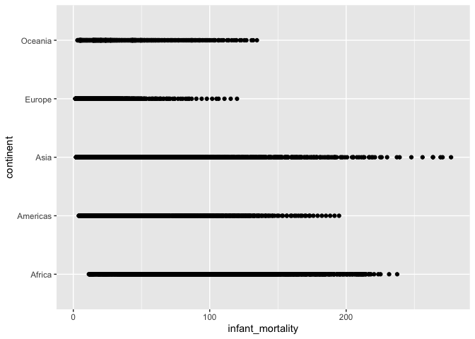

5. Wrangle some more
================
Michael Aung Kyaw
(19 juin, 2022)

# More data wrangling

``` r
library(tidyr)
library(rlang)
library(knitr)
library(dslabs)
library(dplyr)
library(magrittr)
library(ggplot2)
```

## Dataset - Gapminder

As in the example given we will use the data set *gapminder*

## Description of the dataset

``` r
str(gapminder)
```

    ## 'data.frame':    10545 obs. of  9 variables:
    ##  $ country         : Factor w/ 185 levels "Albania","Algeria",..: 1 2 3 4 5 6 7 8 9 10 ...
    ##  $ year            : int  1960 1960 1960 1960 1960 1960 1960 1960 1960 1960 ...
    ##  $ infant_mortality: num  115.4 148.2 208 NA 59.9 ...
    ##  $ life_expectancy : num  62.9 47.5 36 63 65.4 ...
    ##  $ fertility       : num  6.19 7.65 7.32 4.43 3.11 4.55 4.82 3.45 2.7 5.57 ...
    ##  $ population      : num  1636054 11124892 5270844 54681 20619075 ...
    ##  $ gdp             : num  NA 1.38e+10 NA NA 1.08e+11 ...
    ##  $ continent       : Factor w/ 5 levels "Africa","Americas",..: 4 1 1 2 2 3 2 5 4 3 ...
    ##  $ region          : Factor w/ 22 levels "Australia and New Zealand",..: 19 11 10 2 15 21 2 1 22 21 ...

The dataset gampinder contains **10454 observations** from **9
variables** which are

-   **Country** - Factor variable,
-   **Year** - Integer variable,
-   **Infant_mortality**- Numerical variable,
-   **Life_expectancy**- Numerical variable,
-   **Fertility**- Numerical variable,
-   **Population** - Numerical variable,
-   **Continent** - Factor variable,
-   **Region** - Factor variable,

## Transforming data from long to wide format

``` r
longgapminder <- gapminder %>%
  pivot_longer(c("life_expectancy", "fertility", ), names_to = "variable")
longgapminder %>% head() %>% kable()
```

| country | year | infant_mortality | population |         gdp | continent | region          | variable        | value |
|:--------|-----:|-----------------:|-----------:|------------:|:----------|:----------------|:----------------|------:|
| Albania | 1960 |            115.4 |    1636054 |          NA | Europe    | Southern Europe | life_expectancy | 62.87 |
| Albania | 1960 |            115.4 |    1636054 |          NA | Europe    | Southern Europe | fertility       |  6.19 |
| Algeria | 1960 |            148.2 |   11124892 | 13828152297 | Africa    | Northern Africa | life_expectancy | 47.50 |
| Algeria | 1960 |            148.2 |   11124892 | 13828152297 | Africa    | Northern Africa | fertility       |  7.65 |
| Angola  | 1960 |            208.0 |    5270844 |          NA | Africa    | Middle Africa   | life_expectancy | 35.98 |
| Angola  | 1960 |            208.0 |    5270844 |          NA | Africa    | Middle Africa   | fertility       |  7.32 |

## Manipulation fo data

``` r
longgapminder <- longgapminder %>% 
  unite(cont_region, continent, region)
longgapminder %>% head() %>% kable()
```

| country | year | infant_mortality | population |         gdp | cont_region            | variable        | value |
|:--------|-----:|-----------------:|-----------:|------------:|:-----------------------|:----------------|------:|
| Albania | 1960 |            115.4 |    1636054 |          NA | Europe_Southern Europe | life_expectancy | 62.87 |
| Albania | 1960 |            115.4 |    1636054 |          NA | Europe_Southern Europe | fertility       |  6.19 |
| Algeria | 1960 |            148.2 |   11124892 | 13828152297 | Africa_Northern Africa | life_expectancy | 47.50 |
| Algeria | 1960 |            148.2 |   11124892 | 13828152297 | Africa_Northern Africa | fertility       |  7.65 |
| Angola  | 1960 |            208.0 |    5270844 |          NA | Africa_Middle Africa   | life_expectancy | 35.98 |
| Angola  | 1960 |            208.0 |    5270844 |          NA | Africa_Middle Africa   | fertility       |  7.32 |

## Transforming data from wide to long format

``` r
longgapminder <- longgapminder %>% 
  separate(cont_region, into=c("continent", "region"), sep="_")
longgapminder %>% head() %>% kable()
```

| country | year | infant_mortality | population |         gdp | continent | region          | variable        | value |
|:--------|-----:|-----------------:|-----------:|------------:|:----------|:----------------|:----------------|------:|
| Albania | 1960 |            115.4 |    1636054 |          NA | Europe    | Southern Europe | life_expectancy | 62.87 |
| Albania | 1960 |            115.4 |    1636054 |          NA | Europe    | Southern Europe | fertility       |  6.19 |
| Algeria | 1960 |            148.2 |   11124892 | 13828152297 | Africa    | Northern Africa | life_expectancy | 47.50 |
| Algeria | 1960 |            148.2 |   11124892 | 13828152297 | Africa    | Northern Africa | fertility       |  7.65 |
| Angola  | 1960 |            208.0 |    5270844 |          NA | Africa    | Middle Africa   | life_expectancy | 35.98 |
| Angola  | 1960 |            208.0 |    5270844 |          NA | Africa    | Middle Africa   | fertility       |  7.32 |

## Plot

Finally, using our original `gapminder` dataset, let’s plot infant
mortality against life expectancy:

``` r
ggplot(gapminder, aes(infant_mortality, continent)) +
  geom_point()
```

<!-- -->

## Source of the dataset Gampminder

**Irizarry, Rafael A., and Amy Gill. 2021. Dslabs: Data Science Labs.
<https://CRAN.R-project.org/package=dslabs>.**
