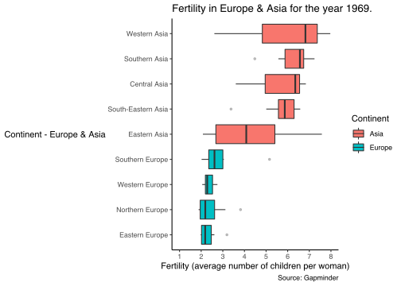
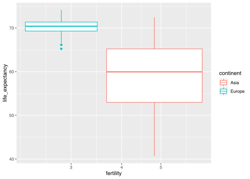

6. Data Visualisation II
================
Michael Aung Kyaw
(19 juin, 2022)

-   [Dataset - Gapminder](#dataset---gapminder)
    -   [Description of the dataset](#description-of-the-dataset)
    -   [Question to answer](#question-to-answer)
    -   [Plot Continent & Year](#plot-continent--year)
        -   [Filter by **Continent** & **Year
            1969**](#filter-by-continent--year-1969)
        -   [Plot **Continent** & **Year
            1969**](#plot-continent--year-1969)
        -   [Interpretation of the plot Continent and Year
            1969](#interpretation-of-the-plot-continent-and-year-1969)
    -   [Plot Life Expectancy & Fertility per
        Continent](#plot-life-expectancy--fertility-per-continent)
        -   [Plot **Life Expectancy** & **Fertility** per
            Continent](#plot-life-expectancy--fertility-per-continent-1)
    -   [Plot Population & Fertility per
        Continent](#plot-population--fertility-per-continent)
    -   [Source of the dataset
        Gampminder](#source-of-the-dataset-gampminder)

This report uses the following R packages:

``` r
library(tidyverse)
library(knitr)
library(dslabs)
library(scales)
library(ggplot2)
library(dslabs)
library (magrittr)
data("gapminder")
```

# Dataset - Gapminder

## Description of the dataset

``` r
str(gapminder)
```

    ## 'data.frame':    10545 obs. of  9 variables:
    ##  $ country         : Factor w/ 185 levels "Albania","Algeria",..: 1 2 3 4 5 6 7 8 9 10 ...
    ##  $ year            : int  1960 1960 1960 1960 1960 1960 1960 1960 1960 1960 ...
    ##  $ infant_mortality: num  115.4 148.2 208 NA 59.9 ...
    ##  $ life_expectancy : num  62.9 47.5 36 63 65.4 ...
    ##  $ fertility       : num  6.19 7.65 7.32 4.43 3.11 4.55 4.82 3.45 2.7 5.57 ...
    ##  $ population      : num  1636054 11124892 5270844 54681 20619075 ...
    ##  $ gdp             : num  NA 1.38e+10 NA NA 1.08e+11 ...
    ##  $ continent       : Factor w/ 5 levels "Africa","Americas",..: 4 1 1 2 2 3 2 5 4 3 ...
    ##  $ region          : Factor w/ 22 levels "Australia and New Zealand",..: 19 11 10 2 15 21 2 1 22 21 ...

The dataset gampinder contains **10454 observations** from **9
variables** which are

-   **Country** - Factor variable,
-   **Year** - Integer variable,
-   **Infant_mortality**- Numerical variable,
-   **Life_expectancy**- Numerical variable,
-   **Fertility**- Numerical variable,
-   **Population** - Numerical variable,
-   **Continent** - Factor variable,
-   **Region** - Factor variable,

## Question to answer

I would like to first *filter the data for the year 1969 in europe* and
asia to see **where does the fertility rate is the higher** Then, i
would like to look **where is life expectancy the highest during the
year 1969 between europe and asia** And if possible i will try to make a
link from **the highest fertility rate country in 1969 between asia and
europe with fertility rate**

## Plot Continent & Year

### Filter by **Continent** & **Year 1969**

We are going to filter the data for the *year 1969* in *Europe and Asia*
Also he will have the first and six last countries that will be
presented

``` r
EA69 <- gapminder %>%
  filter(continent %in% c("Europe","Asia"), year==1969)
  kable(head(EA69 ))
```

| country    | year | infant_mortality | life_expectancy | fertility | population |         gdp | continent | region          |
|:-----------|-----:|-----------------:|----------------:|----------:|-----------:|------------:|:----------|:----------------|
| Albania    | 1969 |             80.2 |           67.55 |      5.16 |    2099657 |          NA | Europe    | Southern Europe |
| Armenia    | 1969 |               NA |           71.10 |      3.31 |    2456370 |          NA | Asia      | Western Asia    |
| Austria    | 1969 |             25.3 |           70.02 |      2.49 |    7473058 | 78426465090 | Europe    | Western Europe  |
| Azerbaijan | 1969 |               NA |           65.14 |      4.75 |    5066080 |          NA | Asia      | Western Asia    |
| Bahrain    | 1969 |             62.4 |           62.22 |      6.69 |     206469 |          NA | Asia      | Western Asia    |
| Bangladesh | 1969 |            150.4 |           47.09 |      6.95 |   63422570 | 17873068964 | Asia      | Southern Asia   |

``` r
  kable(tail(EA69))
```

|     | country              | year | infant_mortality | life_expectancy | fertility | population |          gdp | continent | region             |
|:----|:---------------------|-----:|-----------------:|----------------:|----------:|-----------:|-------------:|:----------|:-------------------|
| 81  | United Arab Emirates | 1969 |             77.2 |           60.33 |      6.68 |     205570 |           NA | Asia      | Western Asia       |
| 82  | United Kingdom       | 1969 |             18.4 |           71.64 |      2.41 |   55406435 | 681308622665 | Europe    | Northern Europe    |
| 83  | Uzbekistan           | 1969 |               NA |           63.20 |      6.55 |   11599763 |           NA | Asia      | Central Asia       |
| 84  | West Bank and Gaza   | 1969 |               NA |           57.22 |      7.92 |    1124929 |           NA | Asia      | Western Asia       |
| 85  | Vietnam              | 1969 |             57.3 |           59.63 |      6.49 |   42309662 |           NA | Asia      | South-Eastern Asia |
| 86  | Yemen                | 1969 |            230.0 |           40.71 |      7.51 |    6047230 |           NA | Asia      | Western Asia       |

``` r
  (str(EA69))
```

    ## 'data.frame':    86 obs. of  9 variables:
    ##  $ country         : Factor w/ 185 levels "Albania","Algeria",..: 1 6 9 10 12 13 15 16 19 21 ...
    ##  $ year            : int  1969 1969 1969 1969 1969 1969 1969 1969 1969 1969 ...
    ##  $ infant_mortality: num  80.2 NA 25.3 NA 62.4 ...
    ##  $ life_expectancy : num  67.5 71.1 70 65.1 62.2 ...
    ##  $ fertility       : num  5.16 3.31 2.49 4.75 6.69 6.95 2.34 2.28 6.67 2.99 ...
    ##  $ population      : num  2099657 2456370 7473058 5066080 206469 ...
    ##  $ gdp             : num  NA NA 7.84e+10 NA NA ...
    ##  $ continent       : Factor w/ 5 levels "Africa","Americas",..: 4 3 4 3 3 3 4 4 3 4 ...
    ##  $ region          : Factor w/ 22 levels "Australia and New Zealand",..: 19 21 22 21 21 18 7 22 18 19 ...

    ## NULL

### Plot **Continent** & **Year 1969**

We are now plotting our data filtered for Europe and Asia in 1969

``` r
ggplot(EA69 , aes(reorder(region, fertility, na.rm = T, FUN = median), fertility, fill=continent)) +
  geom_boxplot(outlier.alpha = 0.3, outlier.size = 1) +
  scale_y_continuous(limits = c(1,8),
                     breaks = seq(1,8,1)) +
  labs(x = "Continent - Europe & Asia",
       y = "Fertility (average number of children per woman)",
       fill = "Continent",
       title = "Fertility in Europe & Asia for the year 1969.",
       caption = "Source: Gapminder") +
  coord_flip() +
  theme_classic() +
  theme(
    axis.title.y = element_text(angle = 0, vjust = 0.5)
  )
```

<!-- -->

### Interpretation of the plot Continent and Year 1969

It seems form our boxplots that **Asia** has a much **higher fertility**
rate than europe for the **year 1969**

In europe, *eastern europe* seems to have the lowest fertility where
*southern europe* have the highest

In asia, *eastern asia* seems to have the lowest fertility rate, even if
there is a lot of variability, while *western asia* has the highest
fertility rate

## Plot Life Expectancy & Fertility per Continent

``` r
 ggplot(data = EA69) +
geom_boxplot(mapping = aes(x = fertility, y = life_expectancy, color = continent, size = population)) + scale_x_log10()
```

<!-- -->

### Plot **Life Expectancy** & **Fertility** per Continent

With this new boxplot we can see that europe which has a lower fertility
rate has higher life expectancy than asia which has a higher fertility
rate We may thus suppose that more fertility could lead to more
individuals being born and maybe more death in young years? This may
invovle further analysis and statisticla tests, as for the precedent
plot Anyways **we can find interesting observation by plotting the
data**

## Plot Population & Fertility per Continent

## Source of the dataset Gampminder

**Irizarry, Rafael A., and Amy Gill. 2021. Dslabs: Data Science Labs.
<https://CRAN.R-project.org/package=dslabs>.**
